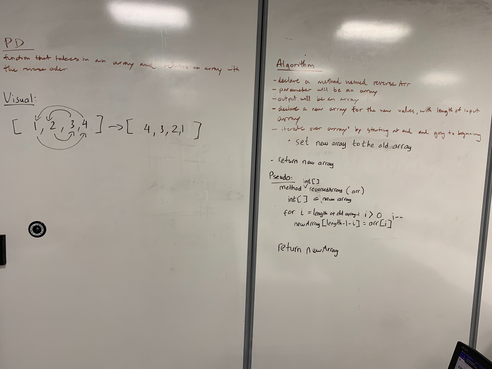

# Reverse an Array
<!-- Short summary or background information -->

## Challenge
<!-- Description of the challenge -->
- Write a method called reverseArray which takes an array as an argument, return an array with elements in reversed order.

## Approach & Efficiency
<!-- What approach did you take? Why? What is the Big O space/time for this approach? -->
- Our first approach was to do a nested for loop and implementing a "break" inside the nested loop.
- After testing out that theory, we wasn't 100% sure that "break" would break only the nested loop or the whole loop.
- Than we decided to loop through the array length starting at the end of the array. And reversing the array from end to beginning.

## Solution
<!-- Embedded whiteboard image -->
