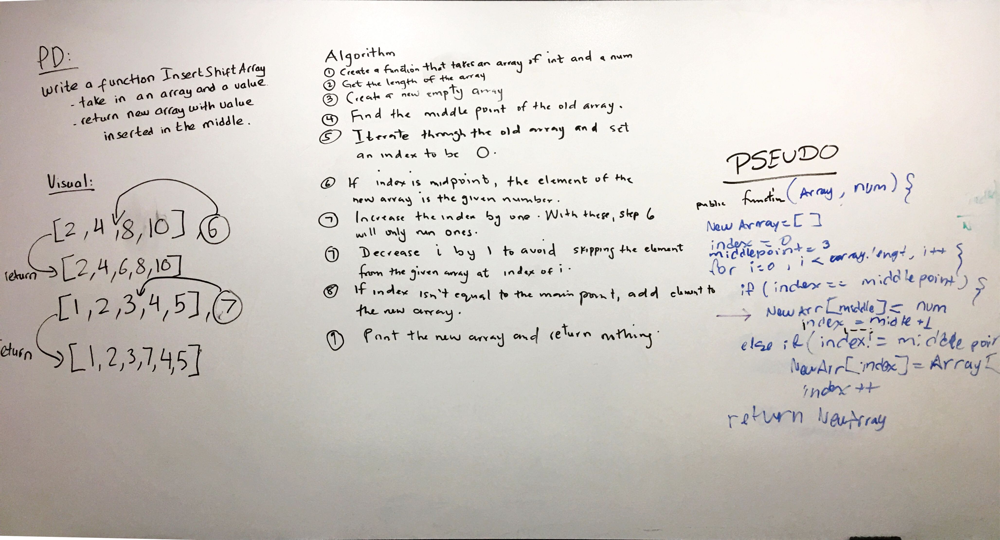

# Insert and shift an array
<!-- Short summary or background information -->

## Challenge
<!-- Description of the challenge -->
- Write a function called insertShiftArray which takes in an array and the value to be added, return an array with the new value added at the middle index.

## Approach & Efficiency
<!-- What approach did you take? Why? What is the Big O space/time for this approach? -->
- Started out with 2 variables to save the index and middle point.
- We spent a good amount of time figuring out the condition of the if statement that we were going to use inside the for loop.
- Finish by incrementing an extra +1 inside the if statement.

## Solution
<!-- Embedded whiteboard image -->
