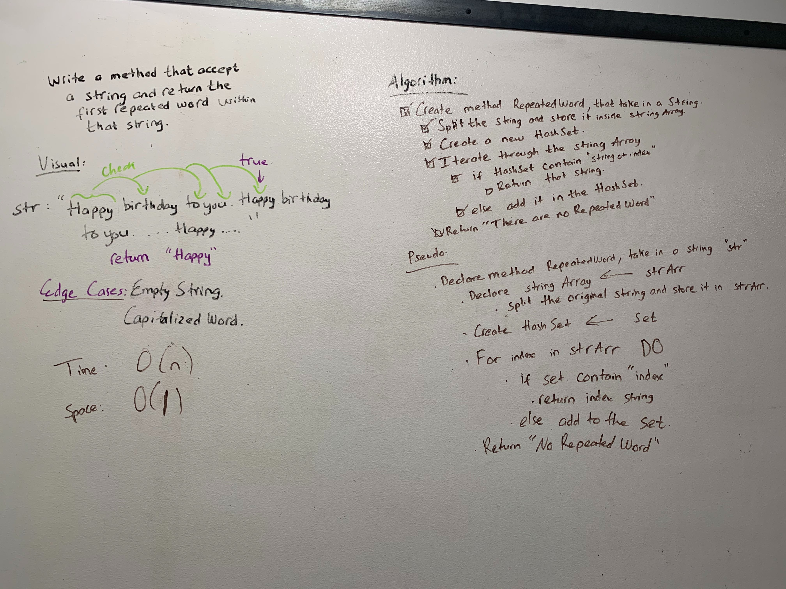

# HashTables

### Challenge
* Implement a Hashtable with the following methods:
* * add: takes in both the key and value. This method should hash the key, and add the key and value pair to the table, handling collisions as needed.
* * get: takes in the key and returns the value from the table.
* * contains: takes in the key and returns a boolean, indicating if the key exists in the table already.
* * hash: takes in an arbitrary key and returns an index in the collection.
* Implement a method that take in a lengthy string parameter and return the first word to occur more than once in that provided string.
### Approach & Efficiency
* Using Linked List to store in Hashtable buckets.
* * Time: O(n)
* * Space O(1)

