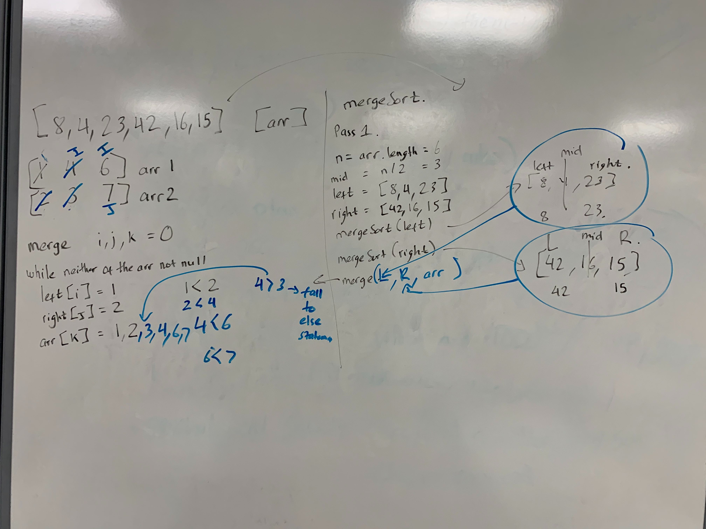

# Merge Sort
### Merge sort is one of the most efficient sorting algorithms. Merge sort repeatedly breaks down a list into several sublists until each sublist consist of a single element and merging those sublists in a manner that results into a sorted list.

### Pseudocode

    ALGORITHM Mergesort(arr)
        DECLARE n <-- arr.length
               
        if n > 1
          DECLARE mid <-- n/2
          DECLARE left <-- arr[0...mid-1]
          DECLARE right <-- arr[mid...n-1]
          // sort the left side
          Mergesort(left)
          // sort the right side
          Mergesort(right)
          // merge the sorted left and right sides together
          Merge(left, right, arr)
    
    ALGORITHM Merge(left, right, arr)
        DECLARE i <-- 0
        DECLARE j <-- 0
        DECLARE k <-- 0
    
        while i < left.length && j < right.length
            if left[i] <= right[j]
                arr[k] <-- left[i]
                i <-- i + 1
            else
                arr[k] <-- right[j]
                j <-- j + 1
                
            k <-- k + 1
    
        if i = left.length
           set remaining entries in arr to remaining values in right
        else
           set remaining entries in arr to remaining values in left

### Trace
Sample Array: [8, 4, 23, 42, 16, 15]

#### Pass through
* In the first pass through of mergeSort, n get declared to be the length of the array "length = 6". We evaluate the mid point and split the the array into two arrays, a left array which goes from 0 to the mid point -1, and a right array which goes from mid point to end of the array.
* left array: [8, 4, 23]  | right array: [42, 16, 15]
* Recursively through the mergeSort, we evaluate the mid point of left array and split them again. And do the same thing with the right array.
*                       [8, 4, 23, 42, 16, 15]
                            /           \
                   [8, 4, 23]            [42, 16, 15]
                     /    \                  /   \
                  [8]    [4, 23]         [42]   [16, 15]
                           / \                     / \
                         [4] [23]               [16] [15]
                         

* The mergeSort(left) and mergeSort(right) recursively break down the array until it have less than 2 values in the array.
* Lastly it use the merge method to merge the array bottom up.
*                 merge([4], [23]) = [4, 23]      |     merge([16], [15]) = [15, 16]
                  merge([8], [4, 23] = [4,8,23]   |     merge([42, [15, 16] = [15, 16, 42]
                                merge([4,8,23], [15, 16, 42]) = [4, 8, 15, 16, 23,42]
                                
                              
                              
  