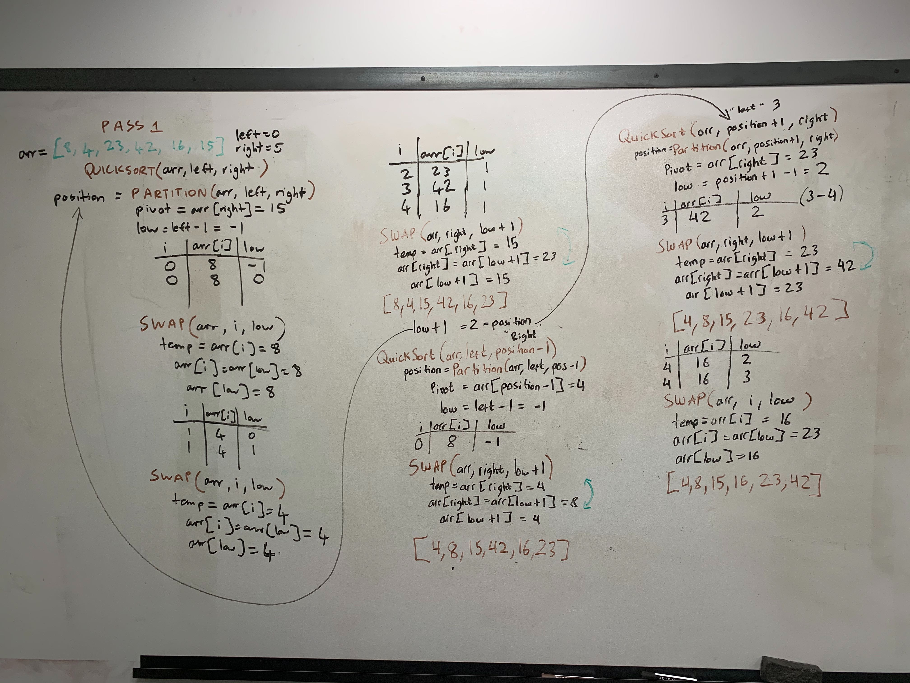

# Quick Sort

QuickSort (sometimes called partition-exchange sort) is one of the most efficient sorting algorithms and is based on the splitting of an array into smaller ones.

#### Trace
Sample Array: [8, 4, 23, 42, 16, 15]

#### Pass 1
* First pass through with the QuickSort method. The inputs are the sample array, left (we'll start at 0), right (in this case the last position is at index 5)
* * Within the Partition function, we declare the "pivot" always going to be the furthest right index position (Can assign random pivot point to improve sort time.). Partition method than place the value of pivot location in the middle while tracking the largest index of numbers lower than defined pivot.
* * Than it called the Swap method which start at that position
``` 
       DEFINE low <-- left - 1
       for i <- left to right do
           if arr[i] <= pivot
               low++
               Swap(arr, i, low)
        Swap(arr, right, low + 1)
        return low + 1
```
* * It perform the swap method putting all numbers smaller than the pivor to the left and larger on the right.
* * Recursively calling QuickSort will splitting the array in half and halve of that while swapping accordingly to the pivot point. 
* * By using recursion to the left and than the right of the pivot index location, it does the swapping in place

#### Worst Case Time: O(n) Best Case if set pivot point at random index location: O(log(n))
#### Space O(n)


  