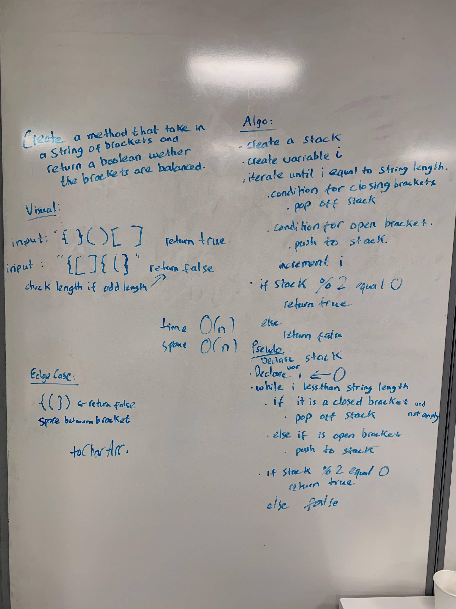

# Challenge Summary
<!-- Short summary or background information -->

## Challenge Description
<!-- Description of the challenge -->
* Your function should take a string as its only argument, and should return a boolean representing whether or not the brackets in the string are balanced. There are 3 types of brackets:

    * Round Brackets : ()
    * Square Brackets : []
    * Curly Brackets : {}
## Approach & Efficiency
<!-- What approach did you take? Why? What is the Big O space/time for this approach? -->
* Approached by using stack implementation. For every open tag, push that tag into the stack. And for every closed tag pop that value out of the stack.
* It is true if the stack is empty after the iteration.
## Solution
<!-- Embedded whiteboard image -->
