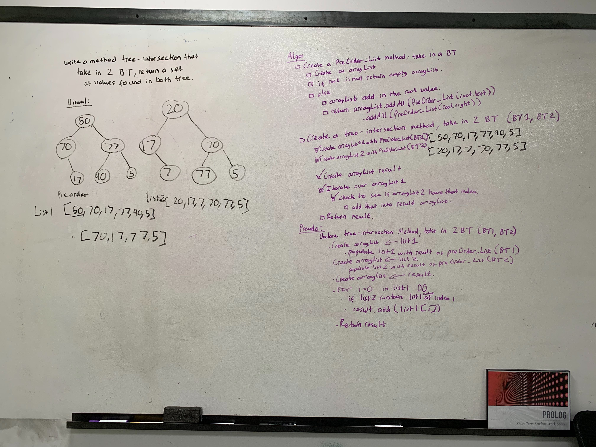

# Tree Intersection
<!-- Short summary or background information -->

## Challenge Description
<!-- Description of the challenge -->
Write a method called tree_intersection that takes two binary tree parameters return a set of values found in both trees.

## Approach & Efficiency
<!-- What approach did you take? Why? What is the Big O space/time for this approach? -->
* Approached by creating a preOrder method to return 2 lists of the nodes for the first tree and second tree.
* Than using that lists to check for similar values and add into the result array then return it.
## Solution
<!-- Embedded whiteboard image -->
