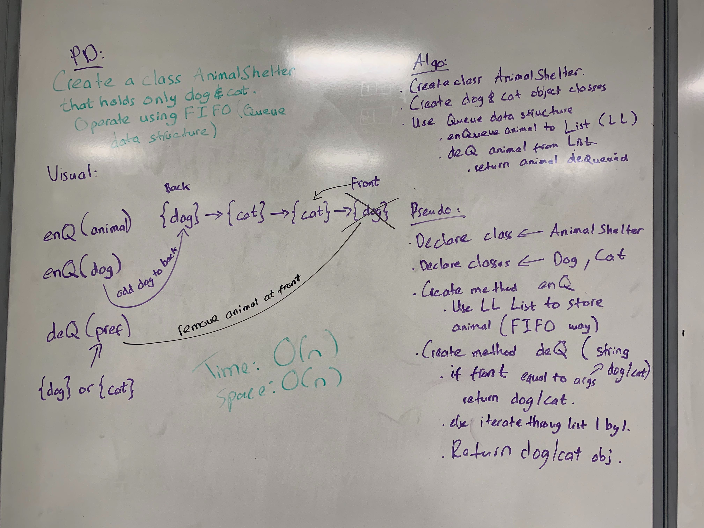

# Challenge Summary
<!-- Short summary or background information -->

## Challenge Description
<!-- Description of the challenge -->
* Create a class called AnimalShelter which holds only dogs and cats. The shelter operates using a first-in, first-out approach.
    * Implement enQueue method that adds animal to the shelter. animal can be either adog or a cat object.
    * Implement deQueue method that return either a dog or a cat.
## Approach & Efficiency
<!-- What approach did you take? Why? What is the Big O space/time for this approach? -->
* Original approach was having a single Linked List and add both dog and cat objects to the Linked List and iterate over and return the most "front of the line" animal to be adopted.
* But after I decided to create 2 Linked Lists, one to store dog objects and other for cat. And return the most front dog/cat user requested.

## Solution
<!-- Embedded whiteboard image -->
