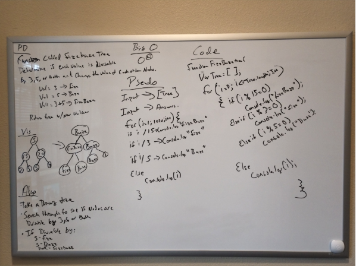

# FizzBuzz Tree
<!-- Short summary or background information -->

## Challenge
<!-- Description of the challenge -->
- Write a function called FizzBuzzTree which takes a tree as a parameter.
- Without utilizing any of the built-in methods available to your language, determine weather or not the value of each node is divisible by 3, 5 or both, and change the value of each of the nodes:
If the value is divisible by 3, replace the value with “Fizz”
If the value is divisible by 5, replace the value with “Buzz”
If the value is divisible by 3 and 5, replace the value with “FizzBuzz”
- Return the tree with its new values.
## Approach & Efficiency
<!-- What approach did you take? Why? What is the Big O space/time for this approach? -->
Our approach was to loop through the tree and return Fizz if its divisible by 3, 5 for Buzz, and FizzBuzz if its divisible by 3 and 5.
## Solution
<!-- Embedded whiteboard image -->
