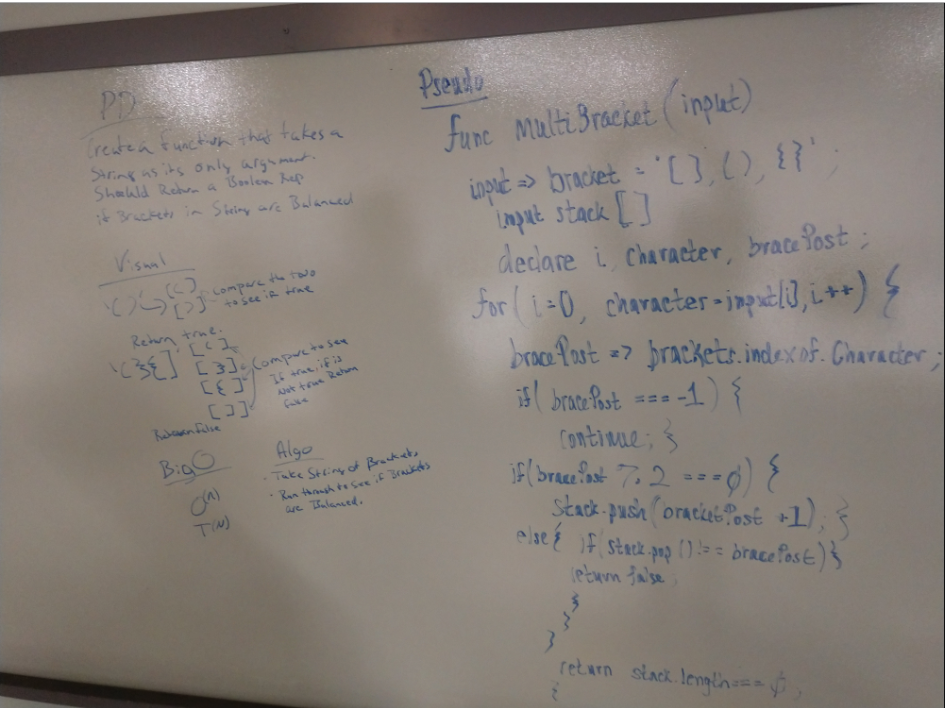

# Multi-bracket Validation.
<!-- Short summary or background information -->

## Challenge
<!-- Description of the challenge -->
- Write a function that take in a string as argument and return a boolean whether or not the brackets in the string are in the correct syntax.
## Approach & Efficiency
<!-- What approach did you take? Why? What is the Big O space/time for this approach? -->
- At first, we approach with getting the index of each position in string.
- Then we use a few conditional if statement to see if there are closing brackets for each indexes and return true if found else return false.

## Solution
<!-- Embedded whiteboard image -->
