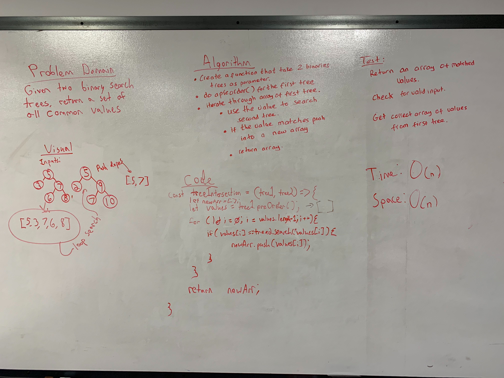

# Intersection of binary trees
<!-- Short summary or background information -->

## Challenge
<!-- Description of the challenge -->
- Write a function that takes in 2 binary trees as parameter and return the matched values in an array.
- Without ultilizing any of the built-in library methods available to your language except the methods that you previously written.
## Approach & Efficiency
<!-- What approach did you take? Why? What is the Big O space/time for this approach? -->

## Solution
