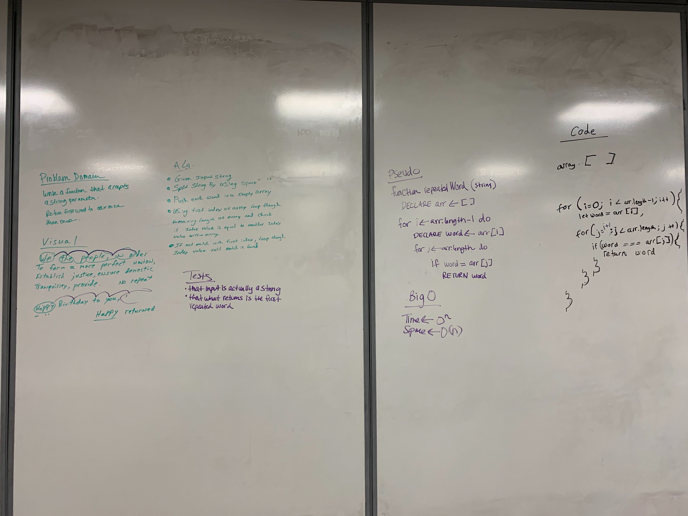

#Challenge Return first repeated word

## Challenge
- Write a function that accept a string as an argument.
- Return the first word that was repeated within that string

## Approach & Efficiency
- First I decided to split the str where there are ' ' (spaces);
- Then I implement a nested for loop and comparing each element to the rest of the array and return a match if found.

## Solution

