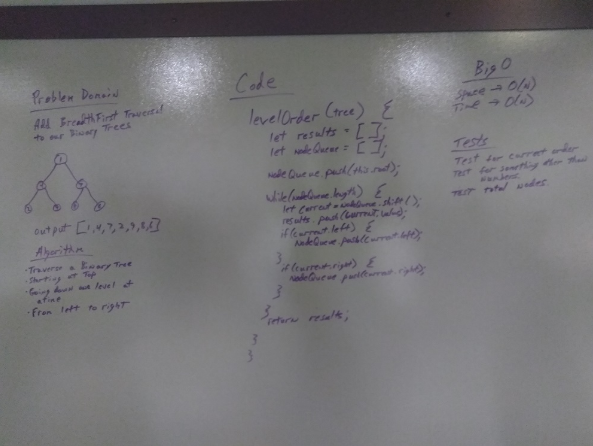
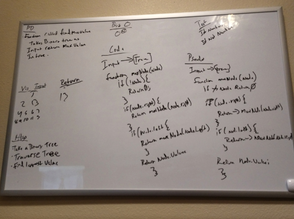

## Challenge
<!-- Description of the challenge -->
Binary trees methods implemented
- preOrder
- postOrde
- inOrder
- breathFirst

## Approach & Efficiency
Added proper testing for breathfirst methods.

## Solution

