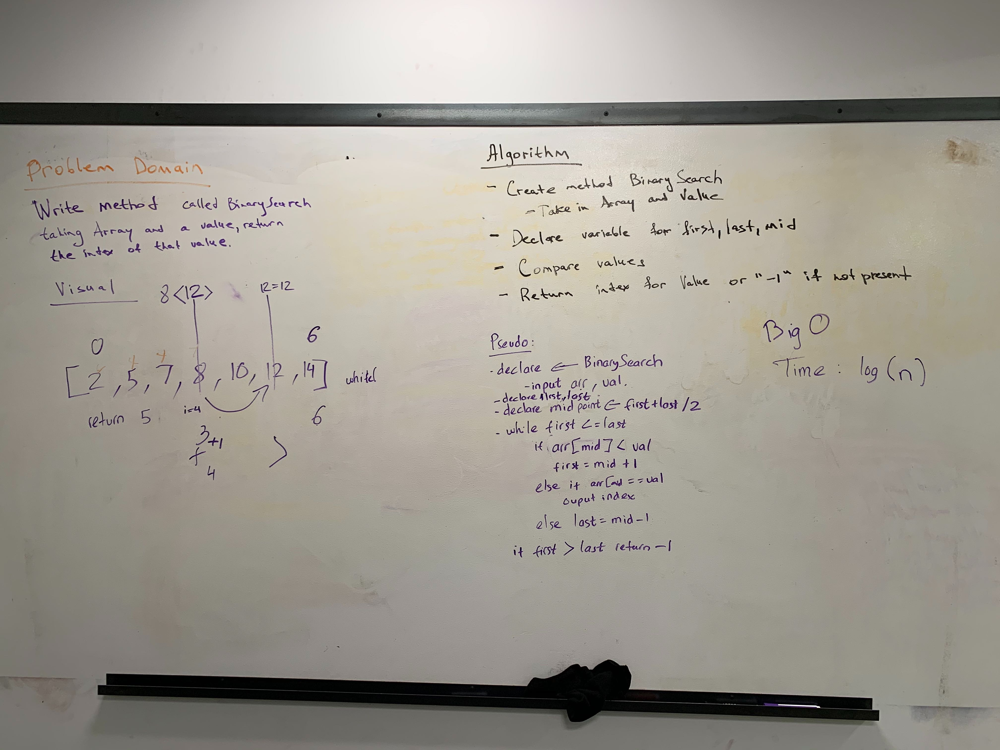

# Binary search in a sorted 1 dimension array
<!-- Short summary or background information -->

## Challenge
<!-- Description of the challenge -->
- Write a function called BinarySearch which takes in 2 parameters: a sorted array and the search key, return the index of the array’s element that is equal to the search key, or -1 if the element does not exist.

## Approach & Efficiency
<!-- What approach did you take? Why? What is the Big O space/time for this approach? -->
- After spending a little time on the visual, we approached with cutting the array into half and compare that with the given value.
- Than depending if the given value is less than or more than the middle point. We than set the new start and end point of the array.
- Finish by looping it with a while loop until it finds its correct value.

## Solution
<!-- Embedded whiteboard image -->
